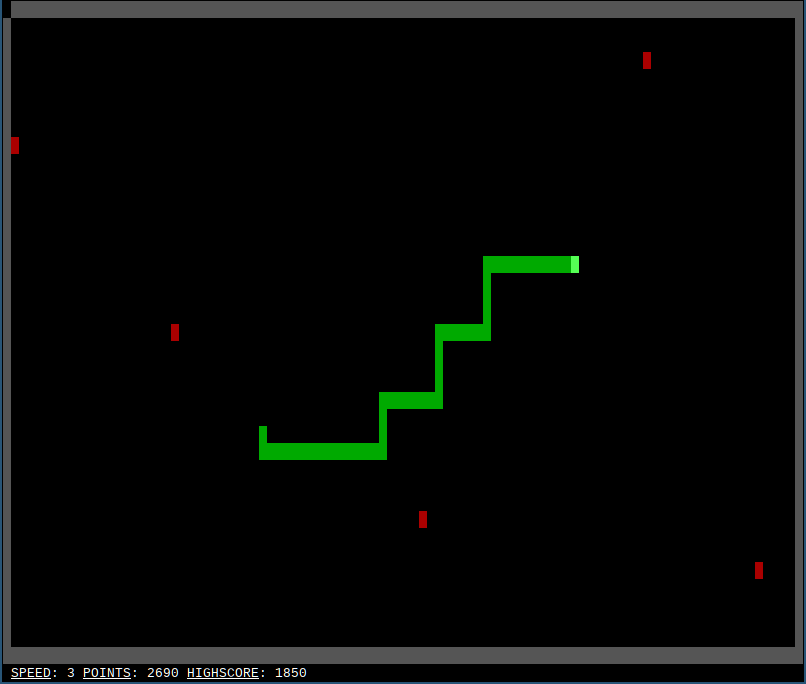

# CNAKE

> A snake clone for terminals written from scratch without any libraries

[](https://repl.it/github/veloek/cnake)

Implementing snake in the terminal would probably be much easier with
something like ncurses, but I wanted to see how far I'd get by only using ansi
escape codes.

Tested on GNU/Linux, macOS and WSL and it works surprisingly well.

```
$ make && ./cnake
```

Use h, j, k and l to move around, just like in [Vim](https://www.vim.org).
Arrow keys are also supported, if you prefer that.



## Roadmap

- [X] Draw game on fullscreen surface
- [X] Handle user input to control snake
- [X] Game loop that moves snake and redraws
- [X] Collision detection
- [X] Statusbar with score and other useful stuff
- [ ] Fancy mode with unicode characters

See [issues](https://github.com/veloek/cnake/issues) for more details.
